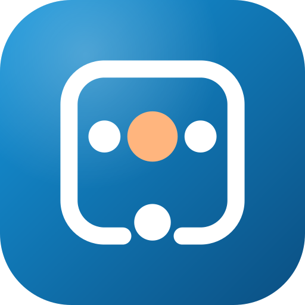
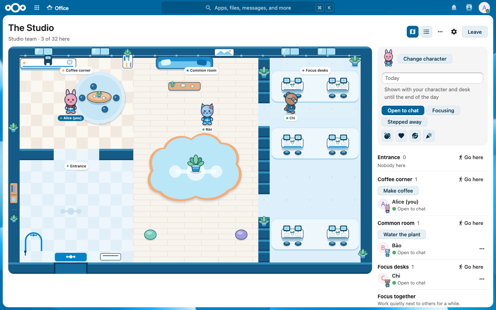
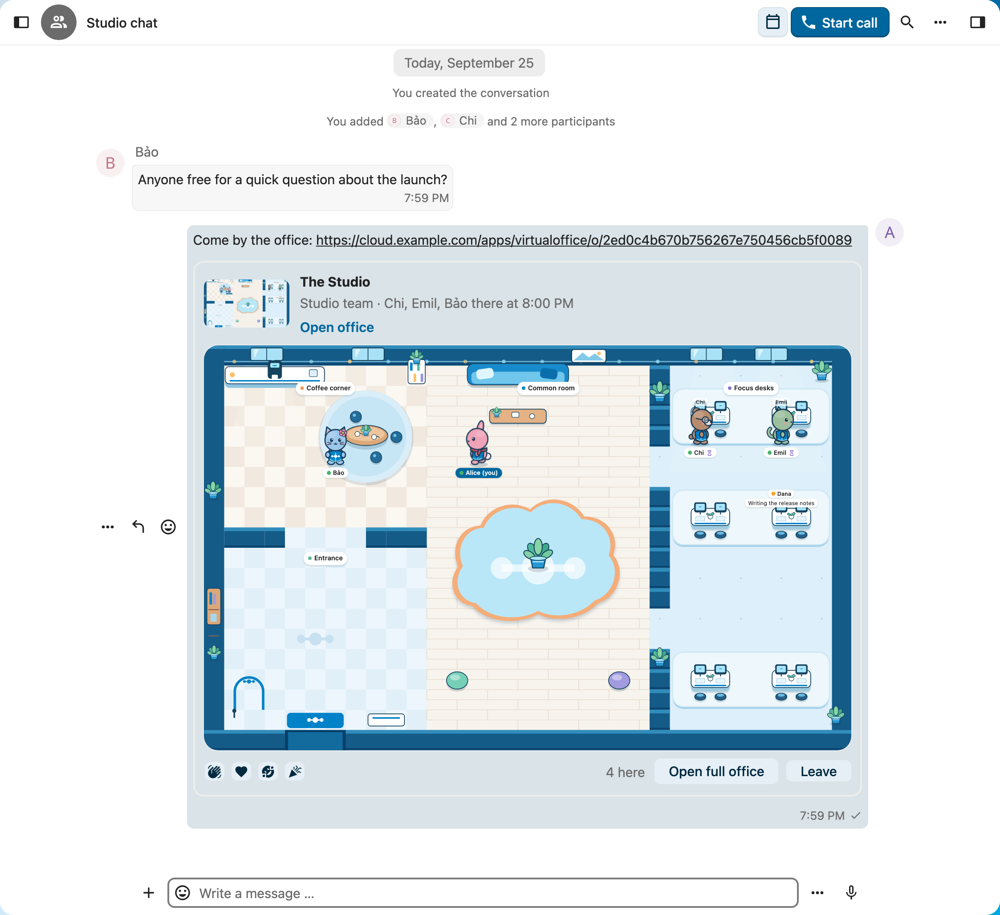
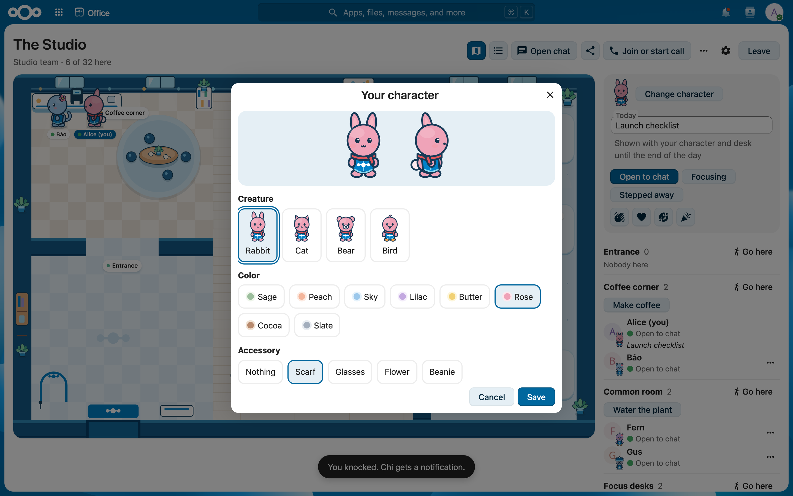
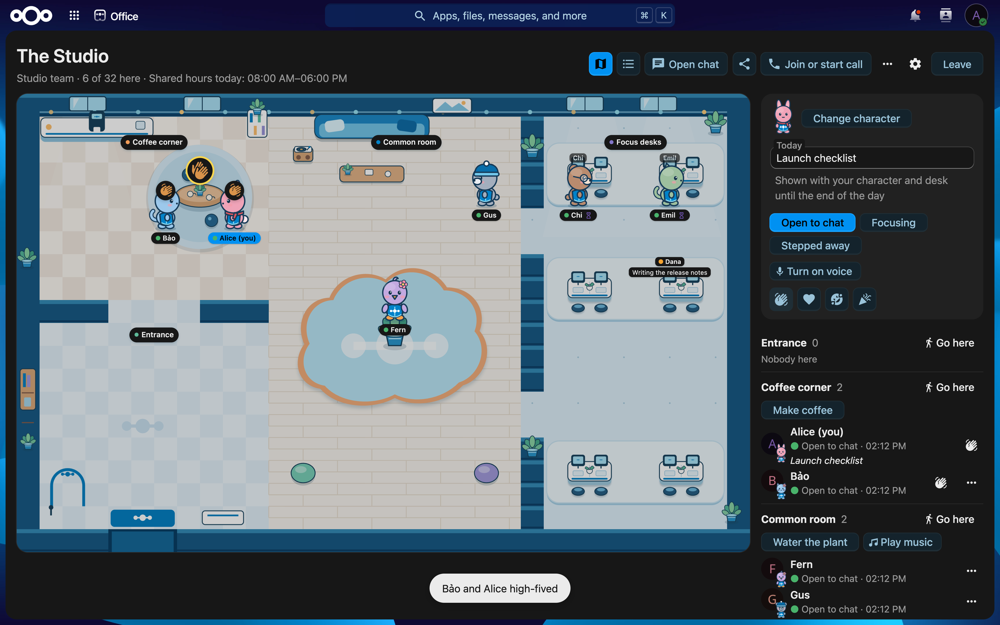

<!--
  - SPDX-FileCopyrightText: 2026 Hoang Pham
  - SPDX-License-Identifier: AGPL-3.0-or-later
-->

<h1 align="center">Virtual Office</h1>

<strong>See who's around. Drop by.</strong> A small shared office for Nextcloud Teams, groups and Talk conversations.

<a href="https://apps.nextcloud.com/apps/virtualoffice">Install from the App Store</a> · <a href="https://hweihwang.com/virtualoffice/">Website</a> · <a href="https://hweihwang.com/virtualoffice/#film">Watch the film</a> · <a href="docs/admin.md">Admin guide</a> · <a href="CHANGELOG.md">What's in 1.0</a> Free and open source for Nextcloud 35.

Virtual Office gives a Nextcloud Team, a group or a Talk conversation a small shared office. Everyone who belongs to it can see who is there, step in as a character and say hi before anyone has to start a call.

## What you can do

- **See who's around.** The office shows who is inside and where. Desks show who is out, with their status and a short note for the day.
- **Drop by.** Walk over, wave or make a coffee together. Knock to ask “got 2 minutes?”; they answer **Now**, **In 10 minutes** or **Later**.
- **Use it right inside Talk.** Open a conversation's office from any message menu, or share an office link in the chat, and step in without leaving the conversation. The office shows when the conversation's call is running.
- **Spend a little time together.** Join a 25 or 50 minute **Focus together** session, or sign up for the weekly **Coffee roulette** in group offices.
- **Find it where you work.** The Dashboard widget shows who is in your offices. Offices also show up in search, the Smart Picker and on Team pages, and Team offices show what is shared with the Team.
- **Make it yours.** Pick a rabbit, cat, bear or bird, then a color and an accessory.

| Pick your character | Light or dark, like the rest of Nextcloud |
|---|---|
|  |  |

## Privacy

Opening an office never makes you visible; you choose **Enter office**. Only members of the Team, group or conversation can find and enter it. Virtual Office keeps no history of visits or movement. Desks, notes, knocks and the other optional features keep only what they need, and the [admin guide](docs/admin.md#privacy) says when each is removed.

## Requirements

- Nextcloud 35. No extra server is needed.
- Optional: Talk for conversation offices and calls (tested with Talk 25), Teams for Team offices, Deck for due cards on Team boards, and Client Push (notify_push) for instant movement.

Without Client Push, browsers check for changes about once a second. The [admin guide](docs/admin.md) covers setup and measured performance.

## Getting started

1. Install Virtual Office from the [Nextcloud App Store](https://apps.nextcloud.com/apps/virtualoffice), then open **Office** from the app menu.
2. Create an office for one of your Teams, or open one from a Talk conversation. Admins can also create group offices and offices for everyone.
3. Choose your character and select **Enter office**.
4. Click or tap a spot to walk there, or use the people and places list.
5. Select **Leave** when you are done. Closing the page also leaves the office.

With the map focused, the arrow keys or W A S D walk, **Enter** uses the coffee machine or the plant next to you, and **1** to **4** send a reaction. The people and places list offers everything the map does and works with screen readers.

## Development

~~~sh
npm ci && composer install
npm run build                 # frontend into js/
tests/fixture/setup.sh push   # Nextcloud 35, PostgreSQL, Talk and Client Push on http://localhost:18935
~~~

| Check | Command |
|---|---|
| PHP unit tests | `composer test:unit` |
| PHP static analysis | `composer psalm` |
| PHP code style | `composer cs:check` |
| JS unit tests | `npm run test:unit` |
| Types and lint | `npm run typecheck && npm run lint` |
| API and browser end-to-end | `npm run test:e2e` (use `VO_TRANSPORT=polling` after `tests/fixture/setup.sh polling`) |
| Load | `npm run test:load -- --people 32 --seconds 60 --mode push` |
| Screenshots, social preview and product page assets | `scripts/marketing/build.sh` |
| Launch film | `node scripts/marketing/film/render.mjs` |
| Release archive | `npm run package` (unsigned, for testing) |
| Signed release | `scripts/sign-release.sh ~/.nextcloud/certificates` |

The [developer guide](docs/architecture.md) explains the architecture and the reasons behind it. [docs/releasing.md](docs/releasing.md) describes how to release.

## License

AGPL-3.0-or-later. Bundled libraries keep their own licenses, listed next to each file in `js/*.license`, with texts in `LICENSES/`. The logo, the icons and the office scene are original SVG artwork in `docs/media/`, `img/` and `src/scene/`. The fonts used to render the marketing assets, in `scripts/marketing/film/fonts/`, are under the SIL Open Font License and are not part of the app. The screenshots show test accounts on a test instance.

Virtual Office is a community app. It is not made or endorsed by Nextcloud GmbH.
